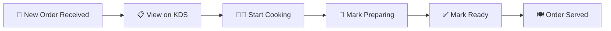
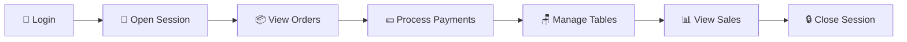
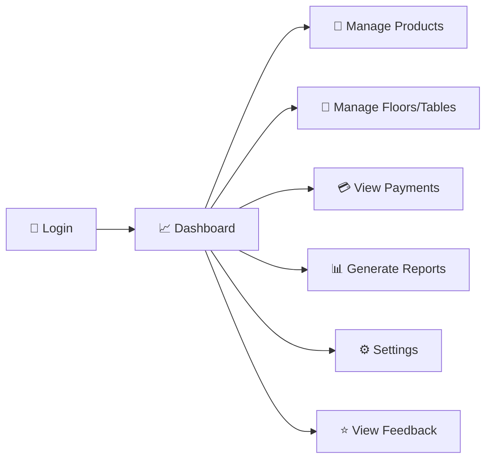
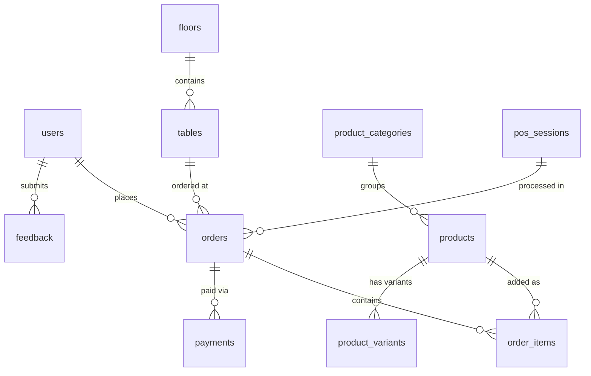

<div align="center">

# ☕ Odoo Cafe POS

### Restaurant Point of Sale System


<br/>

A full-stack **Restaurant POS** web application — customer self-ordering via QR codes, real-time Kitchen Display, cashier POS terminal, and admin dashboard — all in one platform.

**Built for the Adani University Hackathon**

<br/>

[🚀 Live Demo](#-demo-credentials) · [📖 Documentation](#-how-it-works) · [⚡ Quick Start](#-quick-start) · [🌐 Deploy](#-vercel-deployment)

---

</div>

## 📑 Table of Contents

- [✨ Features](#-features)
- [🔄 How It Works](#-how-it-works)
- [🧑‍💻 User Roles](#-user-roles)
- [🛠️ Tech Stack](#️-tech-stack)
- [⚡ Quick Start](#-quick-start)
- [🔑 Demo Credentials](#-demo-credentials)
- [🌐 Vercel Deployment](#-vercel-deployment)
- [🗃️ Database Schema](#️-database-schema)
- [📋 API Reference](#-api-reference)
- [📁 Project Structure](#-project-structure)
- [🔒 Security](#-security)
- [📜 Scripts](#-scripts)
- [👥 Team](#-team)

---

## ✨ Features

<table>
<tr>
<td width="50%">

### 🛎️ Customer Panel
- 📱 Scan QR code at table to start
- 🍕 Browse menu by category
- 🛒 Add to cart & place orders
- 💳 Pay via Cash / UPI QR / Net Banking / Card
- 📍 Track order live (Preparing → Ready → Served)
- ⭐ Submit feedback & star ratings

</td>
<td width="50%">

### 🍳 Kitchen Display (KDS)
- 📋 Real-time order queue
- 🔔 Instant new-order notifications
- 🔄 Update status: To Cook → Preparing → Ready
- ✅ Mark individual items completed
- ⚡ Powered by Socket.IO + Supabase Realtime

</td>
</tr>
<tr>
<td width="50%">

### 💰 Cashier Terminal
- 📂 Open / close POS sessions (shifts)
- 📦 View & manage all incoming orders
- ✍️ Process walk-in orders manually
- 💵 Confirm cash & verify digital payments
- 🪑 Manage table availability
- 📊 Daily sales dashboard

</td>
<td width="50%">

### 🛡️ Admin Dashboard
- 📈 Live stats — revenue, orders, occupancy
- 🍔 CRUD menu products & categories
- 🏢 Manage floors & tables
- 💳 Track all payment transactions
- 📊 Reports with PDF / Excel export
- ⚙️ System settings (tax, UPI, cafe config)
- ⭐ View customer feedback & ratings

</td>
</tr>
</table>

---

## 🔄 How It Works

### 🛎️ Customer Journey

```mermaid
graph LR
    A[📱 Scan QR Code] --> B[🔐 Login / Sign Up]
    B --> C[🏢 Select Floor & Table]
    C --> D[🍕 Browse Menu]
    D --> E[🛒 Add to Cart]
    E --> F[💳 Choose Payment]
    F --> G[✅ Order Confirmed]
    G --> H[🍳 Kitchen Prepares]
    H --> I[📍 Track Live Status]
    I --> J[🍽️ Order Served]
    J --> K[⭐ Leave Feedback]
```



### 🍳 Kitchen Flow



### 💰 Cashier Flow



### 🛡️ Admin Flow



---

## 🧑‍💻 User Roles

| Role | Panel | Description |
|:---:|:---|:---|
| 🛎️ **Customer** | `/customer/*` | Browse menu, order food, pay, track orders, give feedback |
| 💰 **Cashier** | `/cashier/*` | Manage orders, process payments, handle tables, run POS sessions |
| 🍳 **Kitchen** | `/kitchen/*` | View Kitchen Display System, update order/item status in real-time |
| 🛡️ **Admin** | `/admin/*` | Full control — products, floors, tables, payments, reports, settings |

---

## 🛠️ Tech Stack

<table>
<tr>
<td align="center" width="96"><br><b>React 18</b></td>
<td align="center" width="96"><br><b>Vite 5</b></td>
<td align="center" width="96"><br><b>Tailwind</b></td>
<td align="center" width="96"><br><b>Node.js</b></td>
<td align="center" width="96"><br><b>Express</b></td>
<td align="center" width="96"><br><b>Supabase</b></td>
<td align="center" width="96"><br><b>Vercel</b></td>
<td align="center" width="96"><br><b>PostgreSQL</b></td>
</tr>
</table>

<details>
<summary><b>📦 Full Dependency List</b></summary>

#### Frontend
| Package | Purpose |
|:--------|:--------|
| `react` `react-dom` | UI library |
| `react-router-dom` | Client-side routing |
| `tailwindcss` | Utility-first CSS |
| `framer-motion` | Animations & transitions |
| `socket.io-client` | Real-time WebSocket client |
| `@supabase/supabase-js` | Database & realtime subscriptions |
| `qrcode.react` | UPI QR code generation |
| `axios` | HTTP client |

#### Backend
| Package | Purpose |
|:--------|:--------|
| `express` | REST API framework |
| `socket.io` | WebSocket server |
| `jsonwebtoken` | JWT authentication |
| `bcryptjs` | Password hashing |
| `helmet` | Security headers |
| `cors` | Cross-origin handling |
| `winston` | Structured logging |
| `exceljs` | Excel report export |
| `pdfkit` | PDF report generation |
| `express-validator` | Request validation |
| `express-rate-limit` | Rate limiting |

</details>

---

## ⚡ Quick Start

### Prerequisites

| Requirement | Version |
|:---|:---|
|  | 18 or higher |
|  | Comes with Node.js |
|  | Free tier works |

### 1️⃣ Clone the Repository

```bash
git clone https://github.com/your-username/Cafe-POS-Odoo-Adani-Hackathon.git
cd Cafe-POS-Odoo-Adani-Hackathon-main
```

### 2️⃣ Install Dependencies

```bash
# Root dependencies
npm install

# Backend
cd backend && npm install

# Frontend
cd ../frontend && npm install
```

### 3️⃣ Configure Environment

<details>
<summary><b>📄 Backend <code>.env</code></b> (create in <code>backend/</code> folder)</summary>

```env
NODE_ENV=development
PORT=3000

# Supabase — get from your project dashboard
SUPABASE_URL=https://your-project.supabase.co
SUPABASE_ANON_KEY=your-anon-key
SUPABASE_SERVICE_KEY=your-service-role-key

# JWT
JWT_SECRET=your-strong-random-secret-key
JWT_EXPIRES_IN=7d

# Client
CLIENT_URL=http://localhost:5173

# Payment (optional)
UPI_ID=merchant@upi
MERCHANT_NAME=Cafe POS
```

</details>

<details>
<summary><b>📄 Frontend <code>.env</code></b> (create in <code>frontend/</code> folder — optional)</summary>

```env
VITE_API_URL=http://localhost:3000/api
VITE_SOCKET_URL=http://localhost:3000
VITE_SUPABASE_URL=https://your-project.supabase.co
VITE_SUPABASE_ANON_KEY=your-anon-key
```

</details>

### 4️⃣ Setup Database

```bash
cd backend
node setup-database.js
```

### 5️⃣ Run the App

```bash
# Terminal 1 — Backend (port 3000)
cd backend
npm run dev

# Terminal 2 — Frontend (port 5173)
cd frontend
npm run dev
```

### 6️⃣ Open in Browser

```
🌐 http://localhost:5173
```

---

## 🔑 Demo Credentials

| Role | Email | Password |
|:---:|:---|:---:|
| 🛡️ Admin | `admin@demo.com` | `demo123` |
| 💰 Cashier | `cashier@demo.com` | `demo123` |
| 🍳 Kitchen | `kitchen@demo.com` | `demo123` |
| 🛎️ Customer | `customer@demo.com` | `demo123` |

> 💡 After login, you are automatically redirected to the panel matching your role.

---

## 🌐 Vercel Deployment

### Step 1 — Push to GitHub

```bash
git add .
git commit -m "Ready for deployment"
git push origin main
```

### Step 2 — Import in [Vercel](https://vercel.com)

1. Go to **[vercel.com/new](https://vercel.com/new)** → Import your GitHub repo
2. Vercel auto-detects the `vercel.json` configuration
3. Click **Deploy**

### Step 3 — Set Environment Variables

In **Vercel Dashboard → Settings → Environment Variables**:

| Variable | Value | Required |
|:---------|:------|:--------:|
| `SUPABASE_URL` | `https://your-project.supabase.co` | ✅ |
| `SUPABASE_ANON_KEY` | Your Supabase anon key | ✅ |
| `SUPABASE_SERVICE_KEY` | Your Supabase service role key | ✅ |
| `JWT_SECRET` | A strong random string (32+ chars) | ✅ |
| `VITE_SUPABASE_URL` | Same as `SUPABASE_URL` | ✅ |
| `VITE_SUPABASE_ANON_KEY` | Same as `SUPABASE_ANON_KEY` | ✅ |
| `VITE_API_URL` | `/api` or leave unset | ➖ |

> ⚠️ **Serverless Notes:** Socket.IO is unavailable on Vercel — the app falls back to Supabase Realtime. Background jobs (timers, cache) don't run — use Vercel Cron Jobs if needed.

---

## 🗃️ Database Schema



| Table | Description |
|:------|:-----------|
| `users` | All accounts — customer, cashier, kitchen, admin |
| `floors` | Restaurant floors (Ground Floor, First Floor, Outdoor) |
| `tables` | Tables with status & QR tokens |
| `product_categories` | Menu categories (Pizza, Burger, Coffee, Soda) |
| `products` | Menu items — name, price, tax, image, availability |
| `product_variants` | Size / pack variations |
| `orders` | Customer orders with status & totals |
| `order_items` | Individual items in each order |
| `payments` | Transactions (Cash, UPI, Net Banking, Card) |
| `payment_methods` | Available payment options |
| `pos_sessions` | Cashier shift management |
| `kitchen_orders` | Kitchen Display System orders |
| `feedback` | Star ratings (food, service, ambience, cleanliness) |

---

## 📋 API Reference

<details>
<summary><b>🔐 Authentication</b></summary>

| Method | Endpoint | Description |
|:------:|:---------|:-----------|
| `POST` | `/api/auth/login` | Login with email & password |
| `POST` | `/api/auth/signup` | Register new user |
| `POST` | `/api/auth/logout` | Logout & invalidate token |

</details>

<details>
<summary><b>🍔 Products & Menu</b></summary>

| Method | Endpoint | Description |
|:------:|:---------|:-----------|
| `GET` | `/api/products` | List all products |
| `POST` | `/api/products` | Create product _(Admin)_ |
| `PUT` | `/api/products/:id` | Update product _(Admin)_ |
| `DELETE` | `/api/products/:id` | Delete product _(Admin)_ |
| `GET` | `/api/categories` | List categories |

</details>

<details>
<summary><b>📦 Orders</b></summary>

| Method | Endpoint | Description |
|:------:|:---------|:-----------|
| `GET` | `/api/orders` | List orders |
| `POST` | `/api/orders` | Create order |
| `PUT` | `/api/orders/:id/status` | Update order status |
| `POST` | `/api/orders/:id/send-to-kitchen` | Send to kitchen |

</details>

<details>
<summary><b>💳 Payments</b></summary>

| Method | Endpoint | Description |
|:------:|:---------|:-----------|
| `POST` | `/api/payments` | Process payment |
| `GET` | `/api/payments` | List transactions |
| `POST` | `/api/payments/upi-qr` | Generate UPI QR code |
| `GET` | `/api/payments/methods` | Available payment methods |

</details>

<details>
<summary><b>🏢 Tables & Floors</b></summary>

| Method | Endpoint | Description |
|:------:|:---------|:-----------|
| `GET` | `/api/floors` | List floors |
| `GET` | `/api/tables` | List tables |
| `PUT` | `/api/tables/:id/status` | Update table status |

</details>

<details>
<summary><b>🍳 Kitchen</b></summary>

| Method | Endpoint | Description |
|:------:|:---------|:-----------|
| `GET` | `/api/kitchen/orders` | Get kitchen orders |
| `PUT` | `/api/kitchen/orders/:id/status` | Update kitchen order status |

</details>

<details>
<summary><b>📊 Reports & Feedback</b></summary>

| Method | Endpoint | Description |
|:------:|:---------|:-----------|
| `GET` | `/api/reports/sales` | Sales analytics |
| `GET` | `/api/reports/export/pdf` | Export as PDF |
| `GET` | `/api/reports/export/excel` | Export as Excel |
| `POST` | `/api/feedback` | Submit feedback |
| `GET` | `/api/feedback` | Get feedback list |

</details>

<details>
<summary><b>⚙️ System</b></summary>

| Method | Endpoint | Description |
|:------:|:---------|:-----------|
| `GET` | `/api/health` | Health check |
| `GET` | `/api/monitoring/metrics` | System metrics _(Admin)_ |
| `GET` | `/api/admin/settings` | Get settings |
| `PUT` | `/api/admin/settings` | Update settings _(Admin)_ |

</details>

---

## 📁 Project Structure

```
📦 Cafe-POS-Odoo-Adani-Hackathon-main
 ┣ 📂 frontend                    ← React + Vite App
 ┃ ┣ 📂 src
 ┃ ┃ ┣ 📂 pages
 ┃ ┃ ┃ ┣ 📂 admin                 9 pages (Dashboard, Products, Floors, etc.)
 ┃ ┃ ┃ ┣ 📂 cashier               5 pages (Orders, Floor, Session, etc.)
 ┃ ┃ ┃ ┣ 📂 customer              7 pages (Menu, Cart, Payment, etc.)
 ┃ ┃ ┃ ┣ 📂 kitchen               2 pages (Display, Panel)
 ┃ ┃ ┃ ┣ 📄 Login.jsx
 ┃ ┃ ┃ ┗ 📄 Signup.jsx
 ┃ ┃ ┣ 📂 components              Reusable UI (Toast, Sidebar, etc.)
 ┃ ┃ ┣ 📂 contexts                AuthContext, ThemeContext
 ┃ ┃ ┣ 📂 services                API client, socket, Supabase
 ┃ ┃ ┣ 📂 hooks                   Custom React hooks
 ┃ ┃ ┣ 📂 utils                   Constants, helpers, validators
 ┃ ┃ ┣ 📄 App.jsx                 Route configuration
 ┃ ┃ ┗ 📄 main.jsx                Entry point
 ┃ ┗ 📄 package.json
 ┃
 ┣ 📂 backend                     ← Node.js + Express API
 ┃ ┣ 📂 src
 ┃ ┃ ┣ 📂 controllers             11 controllers
 ┃ ┃ ┣ 📂 models                  Data models
 ┃ ┃ ┣ 📂 routes                  18 API route files
 ┃ ┃ ┣ 📂 services                Business logic services
 ┃ ┃ ┣ 📂 middleware              Auth, logging, rate limiting
 ┃ ┃ ┣ 📂 sockets                 Socket.IO handlers
 ┃ ┃ ┣ 📂 config                  DB, env, Supabase config
 ┃ ┃ ┣ 📂 utils                   Logger, error handler
 ┃ ┃ ┣ 📂 jobs                    Background jobs
 ┃ ┃ ┣ 📂 validators              Input validation schemas
 ┃ ┃ ┣ 📄 app.js                  Express app setup
 ┃ ┃ ┗ 📄 server.js               Server entry
 ┃ ┣ 📂 tests                     E2E & unit tests
 ┃ ┗ 📄 package.json
 ┃
 ┣ 📂 api                         ← Vercel Serverless Functions
 ┃ ┣ 📄 index.js                  Express wrapper
 ┃ ┣ 📄 health.js                 Health endpoint
 ┃ ┗ 📄 socket-fallback.js        Socket fallback
 ┃
 ┣ 📄 vercel.json                 Deployment config
 ┗ 📄 package.json                Root scripts
```

---

## 🔒 Security

| Feature | Implementation |
|:--------|:--------------|
| 🔐 **Authentication** | JWT tokens with expiry |
| 🔑 **Password Hashing** | bcrypt with salt rounds |
| 🛡️ **Role-Based Access** | Protected routes per role |
| ✅ **Input Validation** | Express Validator on all endpoints |
| 🚦 **Rate Limiting** | Prevents brute-force attacks |
| 🪖 **Helmet** | Security headers (X-Frame-Options, XSS Protection) |
| 🌐 **CORS** | Configured cross-origin handling |
| 🔒 **Row-Level Security** | Supabase RLS policies |

---

## 📜 Scripts

| Location | Script | Command | Purpose |
|:---------|:-------|:--------|:--------|
| 📦 Root | `vercel-build` | `cd frontend && npm install && npm run build` | Vercel production build |
| ⚛️ Frontend | `dev` | `vite` | Dev server (port 5173) |
| ⚛️ Frontend | `build` | `vite build` | Production build |
| ⚛️ Frontend | `preview` | `vite preview` | Preview build |
| 🖥️ Backend | `start` | `node src/server.js` | Production server |
| 🖥️ Backend | `dev` | `nodemon src/server.js` | Dev server (hot reload) |
| 🖥️ Backend | `test` | `jest` | Run tests |

---

## 💳 Payment Methods

| Method | Flow |
|:------:|:-----|
| 💵 **Cash** | Customer pays cashier → Cashier confirms in POS |
| 📱 **UPI QR** | Dynamic QR generated with exact amount → Customer scans & pays |
| 🏦 **Net Banking** | Online bank transfer flow |
| 💳 **Card** | Card payment processing |

---

## 📡 Real-Time Features

| Feature | Technology |
|:--------|:-----------|
| 🔔 New order notifications | Socket.IO → Kitchen & Cashier |
| 📍 Live order tracking | Supabase Realtime → Customer |
| 🪑 Table status changes | Socket.IO → All panels |
| 🍳 Kitchen stage updates | Socket.IO → Cashier & Admin |
| 📈 Live admin analytics | Socket.IO + Supabase Realtime |

---

## 👥 Team

<div align="center">

Built with ❤️ for the **Adani University Hackathon** — Odoo Cafe POS Challenge

</div>

---

<div align="center">


**⭐ Star this repo if you found it helpful!**

</div>
